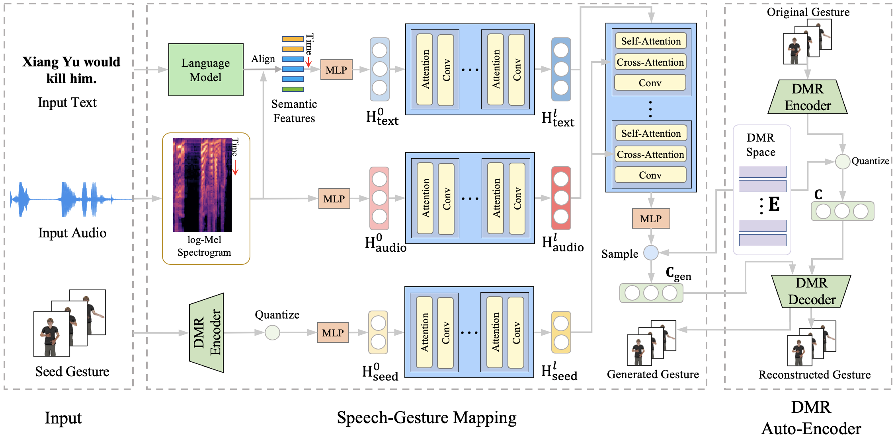

# Salient Co-Speech Gesture Generation

A repository for generating salient co-speech gesture. This is the repository for paper *Salient Co-Speech Gesture Synthesizing with Discrete Motion Representation*.



## Quick Start

### Installation

```shell
conda create -f environment.yml python=3.8
```

### Run

1. Download dataset to `data/baijia_all`
1. Run `train_vae.py -c data/motion_vqvae.yml` to train **Motion Auto-Encoder**.
2. Run `train_transformer.py -c data/motion_vqvae.yml` to train **Speech-Gesture Mapping** network.
3. Run `evaluate_transformer.py` to evaluate FGD and MVD.
4. Run `inference_transformer.py` to evaluate SMS.

## Data

We leverage `lmdb` to store the dataset. The data can be downloaed at [link](https://cloud.tsinghua.edu.cn/d/63d9c4d64690454bbaf7/), and then run `cat xa* > data.mdb`.

## Project Overview

TODO
